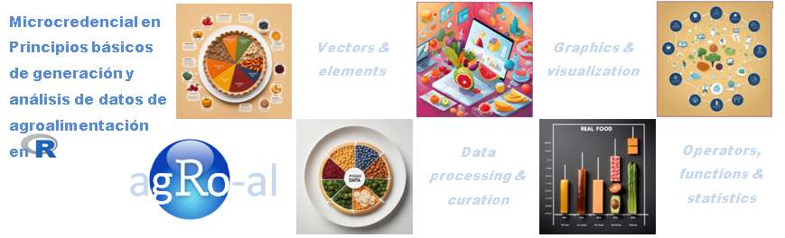

# Microcredencial en "Principios básicos de generación y análisis de datos de agroalimentación en R"

### *Presentación*

La investigación científica en el campo de la **agroalimentación** avanza rápidamente hacia un enfoque **multidisciplinar** e **interdisciplinar** donde convergen diversas aproximaciones tecnológicas las cuales, en su gran mayoría, tienen una alta capacidad de procesamiento de muestras biológicas y generan grandes **volúmenes de información**. En consecuencia, dicha investigación se direcciona inequívocamente hacia la **integración** de múltiples datos generados a partir de diversas **capas de información** de tipo molecular, ambiental, clínica y sociológica –entre otras– que tratan de generar nuevo conocimiento, productos innovadores y desarrollos biotecnológicos ambiciosos.

Si bien es cierto que la formación y la adquisición de competencias en el **entorno R** para el análisis de datos no representa una novedad, la microcredencial propuesta se fundamenta en la particularidad de apropiación inmediata de la herramienta por parte del **personal investigador** en su etapa más temprana de la carrera científica de manera prioritaria pero no limitada a ellos. Tanto la versatilidad como la **política de acceso abierto** de los recursos a difundir, permitirán al estudiante e investigador una inmersión directa y utilización de dichas herramientas en la consecución de sus objetivos de investigación (e.g. tesis doctoral, TFMs, publicaciones, reportes científicos a empresas, etc.). 

### *Objetivo*

La presente **Microcredencial** tendrá como objetivo la formación de personal investigador, tanto del **IATA-CSIC** como con vinculación activa en empresas o instituciones del sector agroalimentario, en competencias académicas para  alcanzar el conocimiento y la habilidad en los siguientes procesos:

<!-- unordered lists -->
1. Organización y creación de datos biológicos relacionados con la agroalimentación
2. Manejo de estructuras de datos y vectores de información
3. Integridad, control de calidad, filtrado y curación de datos
4. Evaluación estadística básica de datos
5. Interpretación y visualización y presentación de datos

### *Datos e información generales de la Microcredencial*

<!-- unordered lists -->
* Modalidad: Presencial.
* Lugar de impartición: **Instituto de Agroquímica y Tecnología de Alimentos (IATA-CSIC)**. [Carrer del Catedràtic Agustín Escardino Benlloch, 7 (Paterna, Valencia)](https://g.co/kgs/LRrDs2k).
* Fecha de preinscripción: ~~del 7 al 31 de enero de 2025~~.
* Fecha de oficialización de matrícula: ~~del 3 al 14 de febrero de 2025~~.
* Fecha de inicio y fin: **Estimado entre el 28 de febrero y el 30 de mayo de 2025**.
* Número de plazas disponibles: ~~40~~.
* Número de horas totales de la formación: 50h (2 ECTS).
* Precio de matrícula: **sin coste** (primera versión financiada por el programa de Microcredenciales CSIC-MICIU).
* Idioma: Castellano/Inglés
* Nivel MEC de aprendizaje: niveles 5 a 8.

### *Destinatarios de la Microcredencial*

Personal investigador con edades entre 25 y  64 años edad y con vinculación vigente con el **IATA-CSIC**, así como personal investigador vinculado a otros institutos y empresas del sector agroalimentario. La formación tiene un nivel básico de aprendizaje en competencias de lenguaje de programacióin R. Por consiguiente, se desaconseja la inscripción en la Microcredencial a personas con conocimientos previos en dichas competencias.

### *Formato y desarrollo de la Microcredencial*

La Microcredencial se impartirá de manera **presencial** en sesiones de **1.5 horas** los días viernes entre 10:30h y 12:00h en la sala de conferencias del IATA-CSIC. Las personas inscritas y matriculadas deberán traer su propio recurso informatico portátil (PCs), del cual la organización no se hará responsable de su mantenimiento, funcionamiento y/o daños que pueda tener durante la duración de la Microcredencial. El equipamiento informático deberá contar con la instalación previa de las versiones más recientes del software:

<!-- unordered lists -->
* [R](https://cran.r-project.org/)
* [RStudio](https://posit.co/download/rstudio-desktop/)

La Microcredencial tendrá una duración de **50 horas (2 ECTS)** y las certificaciones se expedirán únicamente en caso de la asistencia y cumplimiento a todas las horas lectivas programadas y a la superación de la evaluación final. Dicha evaluación final supondrá la presentación y demostración (proyecto de creación y ejecución de un script de R) de las competencias adquiridas durante la Microcredencial a partir del manejo y procesamiento de un conjunto de datos propios o preestablecidos, utilizando cualquiera de los repositorios disponibles para tal fin.

### *Dirección y contacto*

Alfonso Benítez Páez (abenitez@iata.csic.es).

---

### *Sesiones teórico-prácticas*

<!-- unordered lists -->
* [Session 1 - Intro "R 101" (2025.02.28)](session1.html)   &#9745;
* [Session 2 - R functions, operators and objects (2025.03.07)](session2.html)   &#9745; 
* [Session 3 - Understanding R objects (2025.03.14)](session3.html)   &#9745;
* [Session 4 - Creating and manipulating R objects (2025.03.28)](session4.html)   &#9745;
* [Session 5 - Reading and writing R objects (2025.04.04)](https://agro-al.github.io)
* [Session 6 - R packages installation and repositories (2025.04.11)](https://agro-al.github.io)
* [Session 7 - Applying arithmetic, statistics, and generic functions - part 1 (2025.04.25)](https://agro-al.github.io)
* [Session 7 - Applying arithmetic, statistics, and generic functions - part 2 (2025.05.02)](https://agro-al.github.io)
* [Session 8 - Data visualization (2025.05.09)](https://agro-al.github.io)
* [Session 9 - Data project presentations - part 1 (2025.05.16)](https://agro-al.github.io)
* [Session 10 - Data project presentations - part 2 (2025.05.23)](https://agro-al.github.io)

---

### *Material creado por los participantes*

---

### *Financiación y auspicio*

