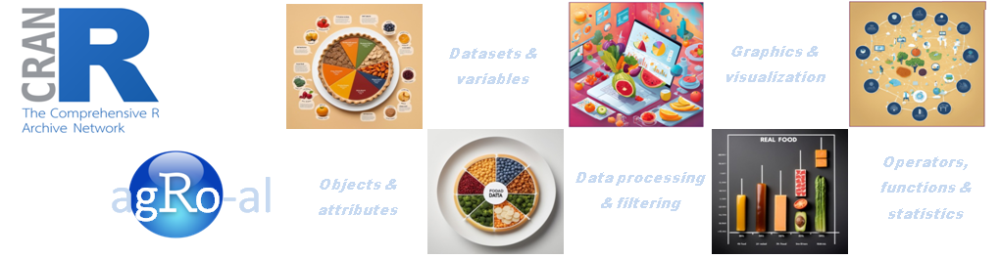

# Microcredencial en "Principios básicos de generación y análisis de datos de agroalimentación en R (*agRo-al*)"

#### La investigación científica en el campo de la agroalimentación avanza rápidamente hacia el enfoque multidisciplinar e interdisciplinar donde convergen diversas aproximaciones tecnológicas las cuales, en su gran mayoría, tienen una alta capacidad de procesamiento de muestras biológicas y generan volúmenes de información masivos. En consecuencia, nuestra investigación se direcciona inequívocamente hacia la integración de una vasta información a partir de diversas capas de información de tipo molecular, ambiental, clínica y sociológica –entre otras– que tratan de generar conocimiento, productos y desarrollos biotecnológicos desde una perspectiva holística.
